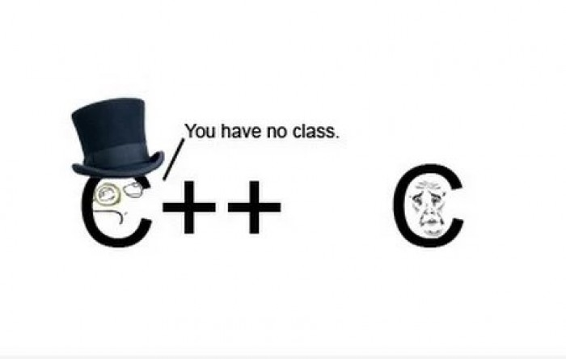
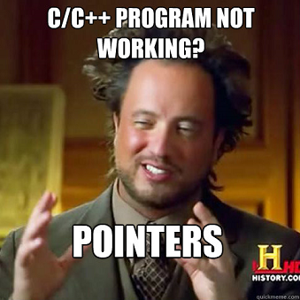

# Coolest implementations
## Augustinas Makevičius

--- 

### 3 užduotis



---
```c++11
void ArKietas(StrongVector<Studentas> &koleg, StrongVector<Studentas> &geek, bool arVidurkiu) {
    auto fx = RibaV;
    if (!arVidurkiu) fx = RibaM;
    auto it = std::stable_partition(koleg.begin(),koleg.end(),fx);
    auto posID = std::distance(koleg.begin(), it);
    geek.assign(koleg.begin(), it);
    koleg.erase(koleg.begin(),it);
}
```
---
```c++11
double Studentas::mediana() {
    std::sort(nDarbai_.begin(), nDarbai_.end());
    return (nDarbai_.size() % 2 == 0 ? (nDarbai_[nDarbai_.size() / 2] + nDarbai_[nDarbai_.size() / 2 - 1]) / 2
                                    : nDarbai_[nDarbai_.size() / 2]) * 0.4 + 0.6 * egzam_;
}
double Studentas::vidurkis(){
    double suma{};
    suma = accumulate(nDarbai_.begin(), nDarbai_.end(), 0.0);
    return (suma / nDarbai_.size()) * 0.4 + 0.6 * egzam_;
}
```
---

### 4 užduotis


---
```c++
void assign(std::initializer_list<T> ilist){
        alokatorius.deallocate(elem, sz);
        elem = alokatorius.allocate(ilist.size());
        std::copy(ilist.begin(),ilist.end(),elem);
        sz = ilist.size();
        cap = ilist.size();
}
template< class... Args > 
iterator emplace( size_type posID, Args&&... args ) {
        if (sz == cap) {
            if (cap == 0) cap = 1;
            else cap *= 2;
            T *new_elem = alokatorius.allocate(cap);
            std::move(elem, elem + posID, new_elem);
            alokatorius.construct(new_elem + posID, std::forward<Args>(args)...);
            std::move(elem + posID, elem + sz, new_elem + posID + 1);
            alokatorius.deallocate(elem, sz);
            elem = new_elem;
        } else {
            std::move(elem + posID, elem + sz, elem + posID + 1);
            alokatorius.construct(elem + posID, std::forward<Args>(args)...);
        }
        sz++;
        return &elem[posID];
}
```

---


---
```c++11
template<typename T, typename Allocator = std::allocator<T>>
class StrongVector : protected VBase<T, Allocator>{}
```
---
```c++11
template<typename... Args> iterator emplace(const_iterator position, Args&&... args){
        if (size() + 1 > max_size()) std::__throw_length_error("Vector::emplace()");
        difference_type posID = position - begin();
        auto old_sz = std::distance(this->implementacija.elemStart, this->implementacija.elemEnd);
        pointer t = new value_type[old_sz + 1];
        if(posID != 0) std::uninitialized_copy(this->implementacija.elemStart, this->implementacija.elemStart + posID, t);
        Allocator_traits::construct(this->implementacija, t + posID, args...);
        std::uninitialized_copy(this->implementacija.elemStart + posID, this->implementacija.elemStart + old_sz, t + posID + 1);
        if (old_sz + 1 > capacity()){
            deallocate(this->implementacija.elemStart, size());
            this->implementacija.elemStart = allocate(old_sz + 1);
            this->implementacija.elemCap = this->implementacija.elemStart + old_sz + 1;
        }
        std::uninitialized_copy(t, t + old_sz + 1, this->implementacija.elemStart);
        this->implementacija.elemEnd = this->implementacija.elemStart + old_sz + 1;
    }
```
---
```c++
template<typename T, typename Alloc>
inline bool operator< (const StrongVector<T,Alloc>& x, const StrongVector<T,Alloc>& y){
    return std::lexicographical_compare(x.begin(),x.end(),y.begin(),y.end());
}

```
---
|Duomenu kiekis                    |Mano Vektorius   |std::vector     |
|----------------------------------|-----------------|----------------|
| n = 10000 | 0.00010101 s. | 9.944e-005 s. |
| n = 100000 | 0.00045159 s. | 0.00055147 s. |
| n = 1000000 | 0.00350957 s. | 0.00471026 s. |
| n = 10000000 | 0.0467975 s. | 0.0584776 s. |
| n = 100000000 | 0.429985 s. | 0.546494 s. |

---

|Duomenu kiekis                    |StrongVector     |std::vector     |
|----------------------------------|-----------------|----------------|
| n = 10000 | 0.00130823 s. | 0.00010027 s. |
| n = 100000 | 0.00044942 s. | 0.00060286 s. |
| n = 1000000 | 0.00356599 s. | 0.00452925 s. |
| n = 10000000 | 0.0497329 s. | 0.0589802 s. |
| n = 100000000 | 0.437506 s. | 0.554439 s. |

---


---

```c++
while (getline(fd, eilute)){
        eilute.erase(remove_if(eilute.begin(), 
        eilute.end(),
        [](char s) 
        { return s == ',' || s == '-' || s == '.' || s == '!' || s == '?' || s == '(' || s == ')' || s == '„' || s == '“';}),
                     eilute.end());
        istringstream zod(eilute);
        for (string w; zod >> w;) {
            std::transform(w.begin(), w.end(), w.begin(), tolower);
            wordsCout[w]++;
            wordsRef[w][eilNr]++;
        }
        eilNr++;
    }
```
---
```c++
void writeCount(ofstream &fr , map<string , size_t> &wordsCout , const map<string , map<size_t , size_t>> &wordsRef) {
    for (auto &i : wordsCout) {
        if (i.second > 1){
            fr << "Zodis:  " << i.first << " pasikartojo " << i.second << " kartus." << endl;
            fr << "Eilutes (eilNr-kartai): ";
            for (auto &j : wordsRef.at(i.first)){
                fr << j.first << "-" << j.second << " ";
            }
            fr << endl << endl;
        }
    }
}
```
---


--- 
```cmake
option(START_GTEST "Use GTEST" OFF)
if (START_GTEST)
    add_subdirectory(lib/googletest-master)
    include_directories(lib/googletest-master/googletest/include)
    include_directories(lib/googletest-master/googlemock/include)
    add_executable(AntraUzduotis cpp/mainTest.cpp cpp/Studentas.cpp 
    headers/Studentas.h cpp/DarbasFailai.cpp headers/DarbasFailai.h 
    cpp/Performance.cpp headers/Performance.h headers/Timer.h StrongVector.h)
    target_link_libraries(AntraUzduotis gtest gtest_main)
else()
    add_executable(AntraUzduotis cpp/main.cpp cpp/Studentas.cpp 
    headers/Studentas.h cpp/DarbasFailai.cpp headers/DarbasFailai.h 
    cpp/Performance.cpp headers/Performance.h headers/Timer.h StrongVector.h)
endif(START_GTEST)
unset(START_GTEST CACHE)
```


